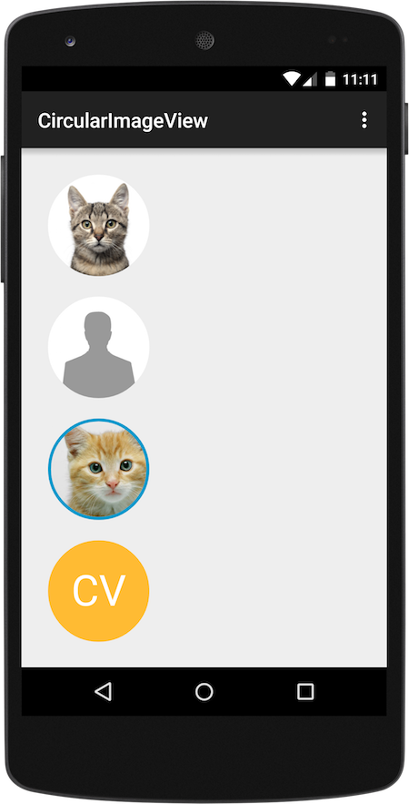

CircularImageView
====
Android ImageView implementation that draws circular images with support for optional placeholder text. CircularTextView works with [Picasso][picasso] & [Glide][glide].


## Dependencies

````xml
dependencies {
    compile 'com.android.support:support-annotations:23.0.0'
}
````

## Download

Download the latest version from [releases][1].

# Usage

**XML:**

````xml
<com.subinkrishna.widget.CircularImageView
    android:id="@+id/image"
    android:layout_width="50dp"
    android:layout_height="50dp"
    android:src="@drawable/c2"
    app:borderWidth="2dp"
    app:borderColor="@android:color/white"
    app:placeholderBackgroundColor="@android:color/black"
    app:placeholderText="CV"
    app:placeholderTextSize="22sp"
    app:placeholderTextColor="@android:color/white" />
````

**Java:**

````java
CircularImageView imageView = findViewById(R.id.image);
imageView.setBorderColor(Color.WHITE);
imageView.setBorderWidth(TypedValue.COMPLEX_UNIT_DIP, 2);
imageView.setPlaceholder("CV", Color.BLACK, Color.WHITE);
imageView.setPlaceholderTextSize(TypedValue.COMPLEX_UNIT_SP, 22);
````

**Custom Attributes**

* `borderWidth` (default: `0`)
* `borderColor` (default: `#FFFFFFFF`)
* `placeholderText`
* `placeholderTextSize` (default: `0`)
* `placeholderTextColor` (default: `#FF000000`)
* `placeholderBackgroundColor` (default: `#FFDDDDDD`)

**Java Methods**

* `setBorderWidth(int unit, int size)`
* `setBorderColor(@ColorInt int color)`
* `setPlaceholder(String text)`
* `setPlaceholder(String text, @ColorInt int backgroundColor, @ColorInt int textColor)`
* `setPlaceholderTextSize(int unit, int size)`

## Samples



**#1 Using Picasso**

XML:

```` xml
<com.subinkrishna.widget.CircularImageView
    android:id="@+id/image1"
    android:layout_width="100dp"
    android:layout_height="100dp" />
````

Java:

````java
CircularImageView i1 = (CircularImageView) findViewById(R.id.image1);
Picasso.with(this)
    .load("https://raw.githubusercontent.com/subinkrishna/CircularImageView/master/art/cat_original.jpg")
    .placeholder(R.drawable.placeholder)
    .centerCrop()
    .resize(200, 200)
    .into(i1);
````

**#2 Using Glide - Error handling**

Placeholder image is shown in the sample since Glide tried to load an image from an invalid URL.

XML:

````xml
<com.subinkrishna.widget.CircularImageView
    android:id="@+id/image2"
    android:layout_width="100dp"
    android:layout_height="100dp"
    app:placeholderBackgroundColor="@android:color/holo_orange_light"
    app:placeholderTextSize="42sp"
    app:placeholderTextColor="#FFF"
    app:placeholderText="CV" />

````

Java:

````java
CircularImageView i2 = (CircularImageView) findViewById(R.id.image2);
Glide.with(this)
    .load("http://invalid.url")
    .asBitmap()
    .error(R.drawable.placeholder)
    .into(i2);
````

**#3 Local asset**

````xml
<com.subinkrishna.widget.CircularImageView
    android:id="@+id/image3"
    android:layout_width="100dp"
    android:layout_height="100dp"
    android:src="@drawable/c1"
    app:borderWidth="3dp"
    app:borderColor="@android:color/holo_blue_dark"/>
````

**#4 Placeholder text with custom border & background**

Placeholder text is shown along with custom border & background when no bitmap is loaded.

````xml
<com.subinkrishna.widget.CircularImageView
    android:id="@+id/image5"
    android:layout_width="100dp"
    android:layout_height="100dp"
    app:placeholderBackgroundColor="@android:color/holo_orange_light"
    app:placeholderTextSize="42sp"
    app:placeholderTextColor="#FFF"
    app:placeholderText="CV"/>
````

## Limitations & known issues

* Supports only `BitmapDrawable`s.
* CircularImageView doesn't resize bitmaps to match the view size.
* No support for animations. Please use `DrawableTypeRequest.asBitmap()` to make CircularImageView to work with [Glide][glide].

## License

    Copyright (C) 2015 Subinkrishna Gopi

    Licensed under the Apache License, Version 2.0 (the "License");
    you may not use this file except in compliance with the License.
    You may obtain a copy of the License at

       http://www.apache.org/licenses/LICENSE-2.0

    Unless required by applicable law or agreed to in writing, software
    distributed under the License is distributed on an "AS IS" BASIS,
    WITHOUT WARRANTIES OR CONDITIONS OF ANY KIND, either express or implied.
    See the License for the specific language governing permissions and
    limitations under the License.

[1]: ../../releases
[picasso]: http://square.github.io/picasso/
[glide]: https://github.com/bumptech/glide